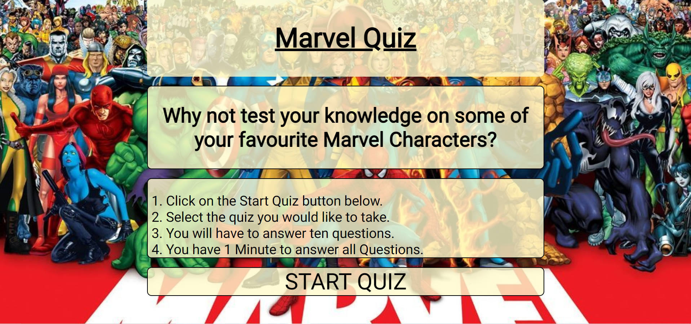
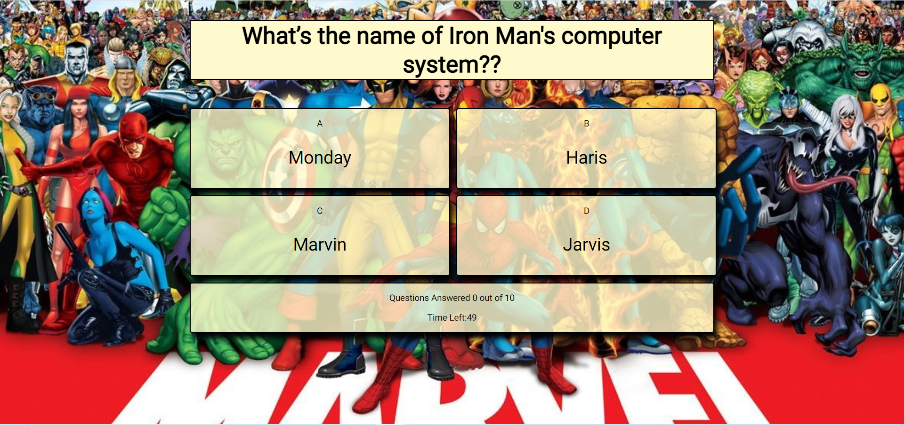
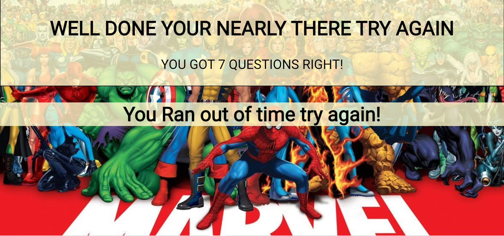
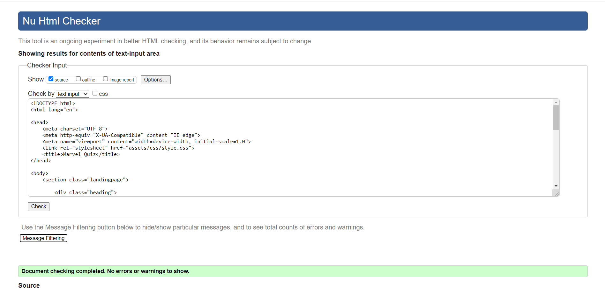
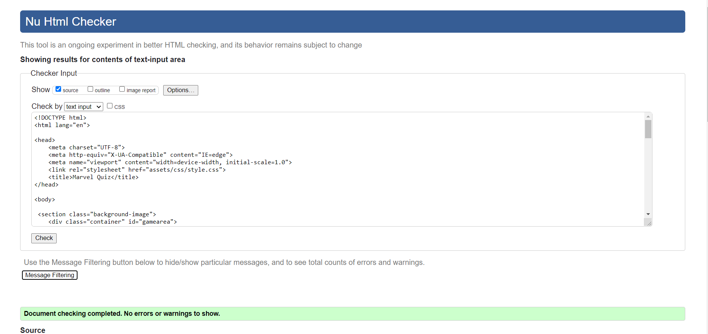
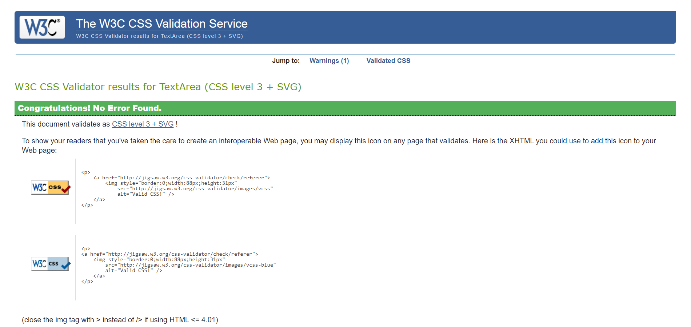
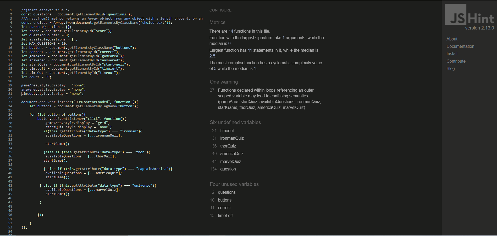

# Marvel Quiz

## Full-Stack Development Course | Portfolio Project 2

View the live project here.[MarvelQuiz](https://newo88.github.io/p2-marvel-quiz/index.html)

The purpose of this site is to give the visitor a fun interactive quiz. This web application would be for anyone but especially any one who is a fan of the Marvel Universe. This is a place they can test there knowledge on some of there favourite characters and see how much they really know. 

## User Experience (UX)

### Site owners Goals

* To have an appealing website for users that they want to come back.
* To provide users a challenging quiz they will enjoy.
* For the users to have fun while playing. 
* For the users to learn something new while playing. 
* Learn a new Programming language while developing this site.

-   ### User stories

    -   #### First Time Visitor Goals

        - Easily navagate around the site.
        - I want to play an enjoyable quiz.
        - I want to know when I get a questions wrong or right.
        - When the quiz is over I would like to know how many I got right and recieve feed back.
        - I want to be able to play on different devices.        

    -   #### Returning Users

        - Easily navagate around the site.
        - Take the same quiz again and recieve different questions.

-  ### Design

    -   #### Colour Scheme
         - The colour scheme I wanted for this quiz was to be bright and cheerful I achieved this by using a background of the Marvel characters.
         For the quiz area I gave the quiz selection boxes a light background as the user could tell clearly if they got the answer correct or incorrect and they are also slightly transparent for a better over all look. 

    -   #### Typography
        -   The Roboto font is the main font used throughout the whole website with Sans Serif as the fallback font in case for any reason the font isn't being imported into the site correctly. Roboto is a clean font used frequently in programming, so it is both attractive and appropriate.
    
    -    #### Wireframes

         - The wireframes for the project can be found here [Wireframe](/workspace/p2-marvel-quiz/assets/wireframes)

-   ### Screenshots of Live Site

-    #### Index Page

-    #### Quiz Selection

-    #### Quiz Play Area

-    #### Time Out Screen

-    #### End of Quiz

## Features

-   Responsive on all device sizes.

-   Multiple Quizs on differnet characters.
-   Random question generator so the user can take the same quiz more than once to get different questions.
-   Timer visible to the user at the bottom of the quiz page to add more of a challenge to the quiz. 
-   A tracking system to let the user know how many questions they answered. 
-   Feed back at the end of the quiz to let the user know how they done.

## Languages Used

-   [HTML5](https://en.wikipedia.org/wiki/HTML5)
-   [CSS3](https://en.wikipedia.org/wiki/Cascading_Style_Sheets)
-   [JAVASCRIPT](https://en.wikipedia.org/wiki/JavaScript)

## Frameworks, Libraries & Programs Used

 - Gitpod was used to write the code for this project.
 - Github was used to host the website.
 - [GoogleFonts](https://fonts.google.com/) Used for the fonts.
 - [Balsamiq:](https://balsamiq.com/) This was used to create the wireframes for the project.
 - [AmIResponsive:](https://amiresponsive.blogspot.com/) This was used to check how responsive the wedsite was.
 - [jSHint](https://jshint.com/)Used to Validate Javascript. 
 - [W3C Markup Validator](https://jigsaw.w3.org/css-validator/#validate_by_input) Used to validate the CSS.
 - [W3C CSS Validator](https://jigsaw.w3.org/css-validator/#validate_by_input)  Used to Validate the HTML.

## Bugs Known Issues
   
 - Issue
   * When a user was taking the quiz the same question would get asked a number of times.
 - Fix
   * In the Javascript code there was a spelling mistake on line 140 which was causing it to not splice out the question when asked.

 - Issue
    * On Chrome Developer Tools the console is logging an error on line 19 of the Javascript code error is Uncaught TypeError: Cannot read property   'style' of null at quiz.js:19. 

 -  Fix
    * This error goes away when the user clicks on the start quiz button. The reason for this error is becuase it does not exist until the user
    goes onto quiz.html. A solution for this still has to be found.

 -  Issue 
    * When a user selected the start quiz button and was taken to the quiz selection page the timer would start. If the user didnt select anything the time out message was displaying even do they didnt start the quiz. 

-   Fix
    * Setting the timer function inside of the start game function meant the timer wouldnt start unless the user click on one of the quizs. 

-   Issue
    * When validating the javascript there was a number of semicolon's missing and also a number of warnings saying 'const' is available in ES6 (use 'esversion: 6') or Mozilla JS extensions (use moz).     

-    Fix
     * Using the log on jShint i added the semicolon's that were missing and also after a google search found that adding /*jshint esnext: true */ to the top of my javascript file would take the warnings away.       

## Testing

This Website was tested with W3C Markup Validator, W3C CSS Validator and jShint with no errors shown.

-   [W3C Markup Validator](https://jigsaw.w3.org/css-validator/#validate_by_input) 
- Index Page
       
- Quiz Page
       
-   [W3C CSS Validator](https://jigsaw.w3.org/css-validator/#validate_by_input)
        
-   [jSHint](https://jshint.com/)
        

-   The Website was tested on Google Chrome, Internet Explorer, Microsoft Edge and Safari browsers.
-   The website was viewed on a variety of devices such as Desktop, Laptop, iPhone7, iPhone 8 & iPhoneX.
-   A large amount of testing was done to ensure that all pages were linking correctly.
-   Friends and family members were asked to review the site and documentation to point out any bugs and/or user     experience issues.

## Deployment

-    The website was deployed to Github pages.

      1. From the Github repository go to 'Settings'.

      2. From there navigate to the section 'Pages'.

      3. From the dropdown menu in the section labeled 'Source' choose the option 'Master Branch' and click 'Save'.

      4. Once saved a notification informing you the site has been published will appear with a link to the website.

### Making a local Clone

-    Steps to clone this repositiory.

       1. On GitHub go to the main page of the Repository.

       2. Above the list of files click the code menu with the drop down arrow.

       3. To clone the repository using HTTPS, under "Clone with HTTPS", click on the clipboard.

       4. Open the Git Bash ternimal.

       5. Change the current working directory to the location where you want the cloned directory.

       6. Type git clone, and then paste the URL you copied earlier from step 3.

       7. Press Enter to create your local clone.

####    To troubleshoot any problems in cloning please go to GitHub pages for more help. [GitHub](https://docs.github.com/en/github/creating-cloning-and-archiving-repositories/cloning-a-repository-from-github/cloning-a-repository#troubleshooting-cloning-errors)

### Credit

- Help with quiz timer [W3School](https://www.w3schools.com/js/js_timing.asp)

- James Q Quirks tutorial on building a quiz app with javascript [YOUTUBE](https://www.youtube.com/channel/UC-T8W79DN6PBnzomelvqJYw)

- MDN Web Docs as an extra resource to understand functions [MDN](https://developer.mozilla.org/en-US/docs/Web/JavaScript/Guide/Functions)

### Content

-   Question were developed by the owner.

-   Background image was sourced from [4KMarvelWallpapers](https://wallpaperaccess.com/4k-marvel)

-   Code for image taking 100% view port [StackOverflow](https://stackoverflow.com/questions/23017857/make-background-image-100-of-viewport)

### Acknowledgements

-   My Mentor Chris for continuous helpful feedback and advice.

-   The good people on Slack and also Steve Fooster and Eddy for the helpful reviews of the project.

